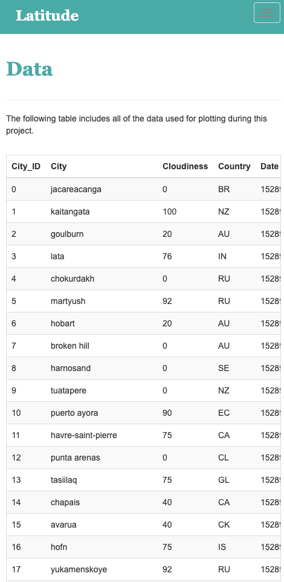

# Web Design - Web Visualization Dashboard (Latitude)

Website url = https://joekimga.github.io/Web-Design-Challenge/

## Background

HTML, CSS, Bootstrap, Python, and Pandas was used to build this weather dashboard.  

For this challenge I created a visualization dashboard website using visualizations we've created in a past challenge. Specifically, we'll be plotting [weather data](Resources/cities.csv).

In building this dashboard, I created individual pages for each plot and a means by which to navigate between them. These pages will contain the visualizations and their corresponding explanations. A landing page is provided where we can see a comparison of all of the plots and the data itself.

### Screenshots

This section contains screenshots of each page that must be built, at varying screen widths. These are a guide; you can meet the requirements without having the pages look exactly like the below images.

#### Landing page

Large screen:

Small screen:



#### Comparisons page

Large screen:

Small screen:

#### Data page

Large screen:

Small screen:

#### Visualization pages

You'll build four of these, one for each visualization. Here's an example of one:

Large screen:

Small screen:

#### Navigation menu

Large screen:

Small screen:

